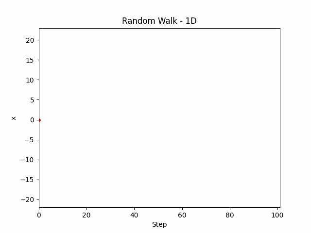
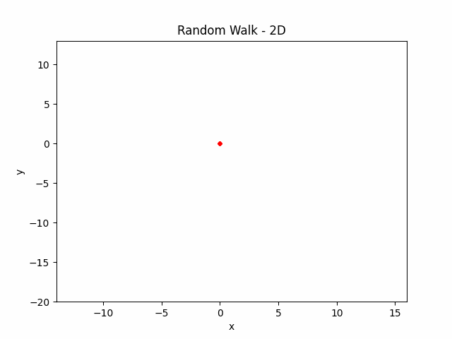
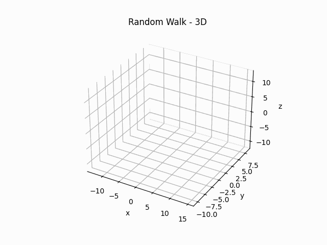

# Random Walk Simulation

Implement random walk simulations using Python. The simulations allow 
users to visualize the paths of multiple random walks in one, two, or 
three dimensions. They can be run as an animation or as a static plot.

<div align=center style="display: flex; justify-content: center; gap: 1%;">
  
  
  
</div>

## Table of Contents
- [Project Structure](#project-structure)
  - [Folders](#folders)
  - [Files](#files)
- [Dependencies](#dependencies)
- [Usage](#usage)
  - [Script](#script)
  - [Executable](#executable)
- [Repackaging Executable](#repackaging-executable)
- [License](#license)

## Project Structure

The structure of the (important parts of the) project is as follows:
```
Root Directory
├── src
│   ├── main.py
│   ├── random_walker.py
│   └── visualis  ation.py
└── images
    ├── plots1d
    │   ├── <name>.png
    │   ├── <name>_mesh.png
    │   └── <name>_hist.png
    ├── plots2d
    └── plots3d
```

### Folders
- **src**: The source code directory.
- **images**: This directory is not here by default. When saving a 
simulation, this directory and its subdirectories are created to store 
the simulation graphs.
<br> _Note_: If running the executable, the directories will be created 
in the same folder containing the newly saved files.

### Files
- `random_walker.py`: Contains the `RandomWalker` class, which is used for simulating a random walk.
- `visualisation.py`: Contains functions for setting up the Matplotlib axes, plotting animations and static plots.
- `main.py`: The main script. It includes a GUI built with tkinter for configuring and running the simulation.

## Dependencies

On top of Python, the project relies on the following external libraries:

- **Matplotlib**: Used for creating the plots.
- **NumPy**: Used for numerical operations and data structuring.
- **SciPy**: Used for fitting a line to histograms.
- **TKinterModernThemes**: Used to give the tkinter GUI a nicer look.

To install the dependencies, you can use the following command:

```bash
pip install -r requirements.txt
```

To install python, see the [official website](https://www.python.org/downloads/)
<br> _Note_: This application was built on Python 3.11 and only tested to work on Windows (10).


## Usage
### Script
1. Run `main.py` to launch the GUI.
2. Configure the simulation parameters using the provided inputs.
3. Click on the "Run Simulations" button.
4. The results of the simulation will appear.

### Executable
1. Open `RWalk.exe`
2. Configure the simulation parameters using the provided inputs.
3. Click on the "Run Simulations" button.
4. The results of the simulation will appear.

## Repackaging Executable
If you wish to make changes to the code and repackage the app to an executable, use the following commands:
```bash
pip install pyinstaller
pyinstaller --noconsole --onefile --add-data "src/icon;icon" --icon=src/icon/icon.ico --name RWalk --collect-data TKinterModernThemes --collect-data PIL src/main.py
```

After `RWalk.spec` is created, simply run:
```bash
pyinstaller RWalk.spec
```

## License

This project is licensed under the MIT License - see the [license](LICENSE.md) file for details.
